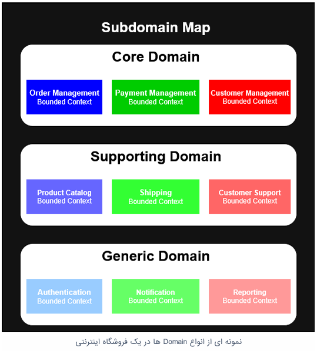
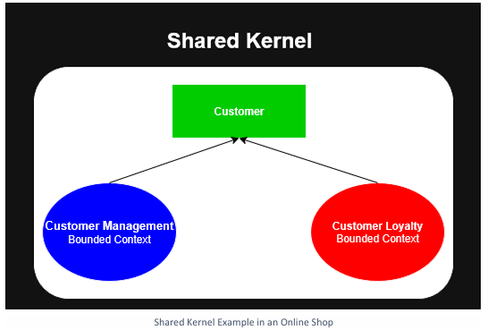
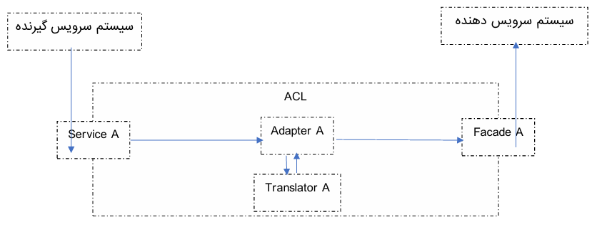
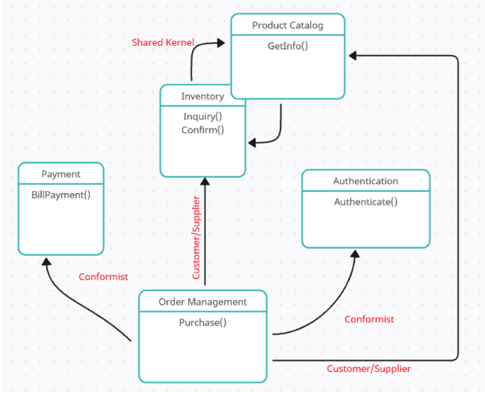

 

# ارتباط Bounded Context و Subdomain ها

هر Subdomain تعداد نیازهای زیادی را در خود جای می دهد که ممکن است توسعه راه حل ها و پیاده سازی نرم افزارهای مربوطه نیاز به چندین تیم توسعه داشته باشد. بنابراین داخل هر Subdomain مجدد نیازمندی های موجود را از لحاظ معنی دسته بندی می کنیم و یک مرزی بین هر دسته بندی ترسیم میکنیم. هر دسته بندی داخل Subdomin یک Bounded Context نامیده می شود. در بخش بعد کامل در مورد Bounded Context ها صحبت خواهیم کرد.

### تعریف Bounded Context

همانطور که در قسمت های قبل اشاره شد، هر نرم افزار حول محور فضای یک مساله شکل می گیرد سپس فضای آن مساله مدل سازی می شود و پروژه نرم افزاری در راستای آن Model توسعه پیدا می کند. Modelیی که در مرحله ظهور مساله شکل می گیرد بسیار کوچک و ساده است، از طرفی این Model باید در تمام طول عمر نرم افزار یکپارچه باشد. هر اصطلاح و مفهومی که در این پروژه نرم افزاری کشف می شود باید در تمام قسمت ها معنی یکسانی داشته باشند. با توجه به این موارد یک سوال مهم شکل به وجود می آید: آیا این کار شدنی است؟ پاسخ: خیر نشدنی است. اما چرا؟

بدیهی است که در مرحله ظهور مساله و مدل سازی اولیه فضای مساله، Model به دست آمده کوچک و ساده باشد اما با پیشرفت پروژه و پرورش فضای مساله و به بلوغ رسیدن Model به تدریج فضای مساله نیز رشد میکند و روز به روز بزرگتر می شود و آن Modelیی که در مرحله اولیه کوچک و ساده بود پس از مدتی تبدیل به یک Model بزرگ و پیچیده می شود و به دنبال آن تعریف هر مفهوم و عبارتی آن قدر بزرگ و جامع می شود که باعث ایجاد ابهام و پیچیدگی در مفاهیم می شود. فرض کنید در Model شما عبارتی به نام X وجود دارد، X ممکن است از نظر هر کدام از تحلیل گران سیستم معنی متفاوتی داشته باشد و به دنبال آن هر کدام از تعریف ها یک سری قانون اعتبار سنجی اضافه می کند که ممکن است بعضی از این قوانین با یکدیگر در تضاد باشند، این یعنی پیچیدگی همراه با ابهام. حفظ این پیچیدگی و کنار آمدن با آن در پروژه دو نتیجه ممکن خواهد داشت: یا پروژه نرم افزاری در نهایت با شکست مواجه می شود و یا پروژه با هزینه های سرسام آور به توسعه خود ادامه خواهد داد. اما راه حل مطمئنی که هم احتمال موفقیت پروژه را بیشتر کند و هم از لحاظ هزینه مقرون به صرفه تر باشد چیست؟

خب روشی که DDD برای این مشکل در نظر گرفته، طراحی Bounded Context ها است. در واقع در این روش طراح نرم افزار هر Domain را به قسمت های مختلف تقسیم می کند هر قسمت با قسمت دیگر مرزی مشخص و زبان مخصوص خود را دارد و مستقل از قسمت های دیگر رشد و توسعه پیدا می کند. به هر کدام از این قسمت ها یک Bounded Context گفته می شود. کار بسیار دشوار در طراحی Bounded Context ها مشخص کردن مرز بین هر Bounded Context با Bounded Context دیگر است. مشخص کردن Ubiquitous Language و وظایف و نقش هر Bounded Context در Domain مربوطه می تواند به طراح در مشخص کردن هر چه بهتر مرزها کمک کند.

با طراحی Bounded Context ها یک سیستم پیچیده به چند سیستم با پیچیدگی کمتر تقسیم بندی میشود که هر قسمت مستقل از قسمت های دیگر تکامل پیدا می کند و هر کدام بر روی جنبه های مختلف Domain کار می کند.

یک عبارت ممکن است در چند Bounded Context وجود داشته باشد و در هر Bounded Context تعریف متفاوت تری نسبت به دیگری داشته باشد. پس به یاد داشته باشید که Model هر Bounded Context باید داخل همان Bounded Context یکپارچه و مطابق با مرزهای آن باشد و نباید از مسائلی که بیرون آن Bounded Context وجود دارند تاثیر بپذیر. مثال اگر عبارت X در Bounded Context معنی متفاوت تری نسبت به آن چه در Bounded Context فعلی تعریف شده، نباید در Bounded Context فعلی تاثیری داشته باشد.

تقسیم Domain به چند Bounded Context و مشخص کردن مرز بین آنها به معنی عدم ارتباط بین آنها نیست بلکه آنها باید برای پیشرفت در راستای هدف Domian با یکدیگر ارتباط و تعامل داشته باشند. نحوه ارتباط Bounded Context ها با یکدیگر پیچیدگی های خاصی دارد که DDD برای حل این مشکل و برای برقراری ارتباط و تعامل بین Bounded Context ها چند نوع روش برقراری ارتباط بین Bounded Context ها معرفی کرده است که شامل موارد زیر می باشد:

* رابطه Shared Kernel
* رابطه Customer/Supplier
* رابطه Conformist
* رابطه Anti-Corruption Layer
* رابطه Separated Ways
* رابطه Open Host Service
* رابطه Partnership

در ادامه هر کدام از این روش ها را تعریف و بررسی می کنیم.

**تعریف Shared Kernel:**
اگر چند Bounded Context داشته باشید و یک سری از مفاهیم و اشیا مشترک در این Bounded Context ها مورد استفاده باشند، برای پیاده سازی دو راه حل دارید یا باید تمام آن اشیا را در هر دو Bounded Context پیاده سازی کنید و یا این اشیا مشترک را در یک Bounded Context جدا ایجاد و نگهداری کنید و باقی Bounded Context ها برای استفاده از آن اشیا به Bounded Context جدید وابسته باشند و از آن استفاده کنند. به این Bounded Context جدید که اشیا مشترک Bounded Context های دیگر را نگهداری می کند Shared Kernel می گویند. و آن مفاهیم مشترک اجزایی از Domain هستند، مثل داده ها و یا سرویس هایی که در قسمت های مختلف سیستم از آن ها استفاده می شود.

برای مثال می توان به مفهوم مشتری در سیستم های نرم افزاری اشاره کرد. اکثر سیستم های نرم افزاری برای خدمت رسانی به یک سری مشتری پیاده سازی شده اند پس مفهوم مشتری در این نوع سیستم ها همیشه وجود دارد و اگر این سیستم نرم افزاری شامل چند Bounded Context باشد احتمالا تعدادی از آنها با موجودیت مشتری سروکار دارند، پس ما در این موقعیت می توانیم یک Shared Kernel بسازیم و موجودیت مشتری در آن تعریف کنیم و پس از آن هر Bounded Contextیی که نیاز به دسترسی به مشتری داشت میتواند از Shared Kernel استفاده کند.

 

اما استفاده از Shared Kernel مزایا و معایبی دارد. شما با در نظر گرفتن این مزایا و معایب باید تصمیم گیری کنید آیا استفاده از این روش برای پروژه شما مناسب است یا خیر.

**مزایا:**

* **صرفه جویی در کدنویسی و زمان:** وقتی از Shared Kernel استفاده می کنید، دیگر مفاهیم مشترک را در چند جا کدنویسی نمی کنید و همین امر باعث کمتر شدن کدها و سریع تر پیش رفتن پروژه میشود.
* **حفظ یکپارچگی Domain:** اگر آن مفاهیم مشترک اجزای Domain باشند و نیاز باشد که حتما در تمام قسمت های مختلف سیستم یک تعریف با ویژگی های مشخص و ثابت داشته باشند، الگوی Shared Kernel کمک می کند تا یکپارچگی این مفاهیم در کل سیستم حفظ شود.
* **کمک به درک بهتر Domain و کد:** از آن جایی که برای این اشیا مشترک فقط یک تعریف در Shared Kernel داریم پس یک شی چندین بار در Bounded Context های مختلف پیاده سازی نمی شود، و همین موضوع که یک تعریف فقط در یک قسمت از پروژه وجود دارد باعث درک بهتر آن شی در کد و Domain می شود.

**معایب:**

* **ایجاد وابستگی زیاد در پروژه:** اگر قرار باشد تعدادی Bounded Context به یک Shared Kernel وابسته باشند، پس هر تغییری در Shared Kernel به معنی تغییر در تمام Bounded Context های وابسته است.
* **نگهداری و توسعه با هزینه بالا:** از آن جایی که مفاهیم Domain مداوم در حال تکامل هستند پس مفاهیمی هم که در Shared Kernel تعریف می شوند دچار تغییر و تحول می شوند. پس هر تیمی که بخواهد این تغییرات را در Shared Kernel اعمال کند ابتدا باید تمام Bounded Context ها را در جریان این تغییر بزارد و با تیم های توسعه مختلفی هماهنگی انجام شود که این کار هم زمانبر است و هم فرآیند توسعه را کند می کند.

**توصیه ای برای استفاده از Shared Kernel:** سعی کنید تا جای ممکن Shared Kernel را کوچک نگه دارید و فقط مفاهیمی از Domain را در آن تعریف کنید که نیاز است یکپارچگی آنها در تمام قسمت های مختلف سیستم حفظ شود. همچنین برای Shared Kernel تست های مناسبی در Bounded Context های وابسته بنویسید تا بعد از تغییر Shared Kernel با اجرای تست ها از عملکرد صحیح Bounded Context های وابسته اطمینان حاصل کنید.

**تعریف Customer/Supplier:**
بعضی وقت ها دو Bounded Context باید یک فرآیند را با همکاری یکدیگر انجام دهند که طی این همکاری نیاز است یکی از Bounded Context ها دیتای مورد نیاز دیگری را تهیه کند. در واقع Bounded Context یی که برای انجام وظیفه خود وابسته به Bounded Context دیگری است. در طراحی معماری نرم افزار سیستمی که سرویس دهنده است در اصطلاح Upstream تلقی میشود و سیستمی که سرویس گیرنده است Downstream تلقی می شود. حال اگر در این نوع رابطه توافق شود که Upstream طبق نیاز Downstream سرویس بدهد یعنی Downstream نیازمندی های خود را مشخص کند و Upstream طبق آن نیازمندی ها سرویس های خود را توسعه دهد به این نوع رابطه بین این دو Bounded Context رابطه Customer/Supplier گفته می شود. در واقع Customer همان سیستم وابسته است و Supplier همان سیستمی که سرویس مورد نیاز Customer را تهیه می کند. حالا چرا نام گذاری Customer/Supplier برای این نوع رابطه انتخاب شده است؟ چون بسیار شبیه به رابطه یک تامین کننده و یک مشتری است. فرض کنید شما یک فروشگاه مواد غذایی دارید و بیشتر مشتریان شما تقاضای یک برند خاصی از یک شکلات را دارند پس قاعدتا شما طبق نیاز مشتریان خود آن برند از شکلات را بیشتر در فروشگاه خود موجود می کنید. در واقع شما به عنوان یک تامین کننده مواد غذایی محصولات فروشگاه خود را طبق نیاز مشتریان خود تامین می کنید.

در رابطه Customer/Supplier در سیستمی که Supplier است نیازمندی های Customer اولویت بالاتری نسبت به تصمیمات Supplier دارد، به عبارت دیگر Supplier سعی می کند خود را با خواسته Customer وفق دهد. اما این نکته هم مهم است که نیازمندی های Customer نباید برای ساختار و قوانین Supplier مخرب باشند. درست است که در تصمیم گیری های سمت Supplier نیازمندی های Customer اولویت دارند اما هر چیزی که از طرف Customer درخواست شود ممکن است از سمت Supplier قابل ارائه نباشد پس باید با مذاکره بین دو تیم یک بالانسی ایجاد شود که هم نیازمندی های Customer تا جای ممکن پاسخ داده شوند و هم Supplier مجبور به نقض قوانین و محدودیت هایی که دارد نشود.

این نوع رابطه نیاز به هماهنگی و همکاری نزدیک دو تیم Customer و Supplier دارد تا با یکدیگر بر سر نوع سرویسی که قرار است تیم Supplier توسعه دهد و دیتایی که باید در این سرویس رد و بدل شود توافق کنند. به همین منظور توصیه می شود که برای ارتباط بهتر و موثرتر حتما از اعضای تیم Customer در جلسات Planning تیم Supplier حضور داشته باشند و هر زمان که اعضای تیم Supplier نیاز داشتند بتوانند با اعضای تیم Customer ارتباط داشته باشند.

تیم Supplier با تیم Customer قراردادی مشخص میکند تا تعداد سرویس های مورد نیاز و دیتای مورد نیاز در هر سرویس را مشخص کنند. از این پس تیم Supplier توسعه را شروع میکند و هر کجا نیاز به همفکری تیم Cuswtomer داشت این تیم باید همکاری کند. پس از آماده شدن سرویس ها و تحویل آنها به تیم Customer تیم Supplier باید به گونه ای از این قرارداد نگهداری کند که تغییری در آن ایجاد نشود چرا که تیم Customer برای انجام وظایف خود وابسته به این سرویس ها است و اگر مورد در این سرویس ها تغییر کند تیم Customer دچار مشکل می شود.

برای حفظ جامعیت و یکپارچگی قراردادی که بین دو تیم در نظر گرفته شده، توصیه می شود که در سمت تیم Supplier یک سری Acceptance Test روی این قرارداد نوشته شود. با نوشتن این تست ها از این پس تیم Supplier می تواند توسعه سیستم خود را بدون نگرانی ادامه دهد چرا که اگر قسمتی از پروژه دچار تغییر شود که این قرارداد را نقض کند از طریق پاس نشدن Acceptance Test ها می توان متوجه آن شد و قبل Deploy شدن پروژه و تحت تاثیر قرار گرفتن Customer جلوی آن را گرفت. حال اگر این تست ها به صورت تست اتوماتیک پیاده شوند که بسیار موثرتر هم خواهند بود.

**مزایا:**

* **وظایف مشخص:** تیم Customer می داند که برای انجام وظایف خود دقیقا به چه دیتایی نیاز دارد و باید آن دیتا را از طریق چه سرویس و از کدام تیم دریافت کند، از طرفی دیگر تیم Supplier می داند که سرویس که باید ارائه کند مربوط به کدام تیم است و برای کدام فرایند این سرویس استفاده خواهد شد.
* **ماژولار بودن:** هر بخشی از فرایند در چند سرویس پیاده سازی می شود و در صورت نیاز می توان آن سرویس را جایگزین کرد.
* **کپسوله سازی:** تیم Customer دیتای مورد نیاز خود را از طریق سرویسی که تیم Supplier ارائه داده به دست می آورد و کار خود را پیش می برد بدون آنکه از جزییات داخل سرویس باخبر باشد.

**معایب:**
**وابستگی شدید بین دو تیم:** از آنجایی که تیم Customer وابسته به تیم Supplier است اگر تیم Supplier سرویسی که قبلا به تیم Customer داده است را تغییر دهد فرایندهای تیم Customer مختل می شوند.
**نیازمند هماهنگی بالا بین دو تیم:** برای تحویل یک سرویس کارآمدی که تمام نیازهای Customer را پاسخ دهد باید هماهنگی های زیادی بین دو تیم انجام شود، همچنین بعد از تحویل سرویس ممکن است هماهنگی هایی برای حفظ جامعیت سرویس یا تغییر سرویس صورت پذیرد.

**توصیه ای برای استفاده از Customer / Supplier:** این نوع رابطه بین Bounded Context ها جایی خوب عمل میکند که هر دو Bounded Context توسط دو تیم توسعه ای در حال توسعه هستند که آن دو تیم تحت نظارت یک مدیر کار می کنند، چرا که در این صورت هدف های تعریف شده برای هر دو تیم در یک راستا هستند و راحت تر می توانند بایکدیگر هماهنگ باشند و در راستای نیازمندی های یکدیگر حرکت کنند.

**تعریف Conformist:**
زمانی که یک رابطه Upstream/Downstream بین دو Bounded Context وجود داشته باشد و تیم توسعه آن دو Bounded Context مدیران جدا داشته باشند یا در بخش های کاملا متفاوت یک سازمان بزرگ باشند یا اصلا در سازمان های جدا باشند احتمالا رابطه این دو Bounded Context نمی تواند از نوع Customer/Supllier باشد چرا که این دو تیم به احتمال زیاد هدف های متفاوتی برای توسعه دارند و نمی توانند سطح بالایی از همکاری و یکپارچگی را با یکدیگر داشته باشند. از همین رو نیازمندی های Downstream برای Upstream اهمیت کمتری دارند، پس تیم Upstream تمایلی برای ارائه سرویس های مورد نیاز به Downstream ندارد همچنین تمایلی برای مذاکره و همکاری و یکپارچگی هم با Downstream ندارد، چرا که هدف کاملا متفاوت و اولویت های مهمتری از نیازمندی های Downstream دارد. در چنین شرایطی که Upstream نمی تواند پاسخگوی نیازمندی های Downstream باشد سه راه حل وجود دارد:

* از بین بردن وابستگی بین Upstream و Downstream یا به عبارتی حذف رابطه Upstream/Downstream
* دریافت سرویس از Upstream و اعمال تغییر یا پردازش بر روی خروجی سرویس های Upstream به نحوی که یکپارچه با مدل سازی Downstream باشد
* تبعیت کردن Downstream از مدل سازی Upstream به نحوی که مدل سازی Downstream همانند مدل سازی Upstream باشد

به رابطه ای که Downstream تابع Upstream است Conformist گفته می شود. در این نوع رابطه Downstream مدل سازی Upstream را انتخاب می کند و طبیعتا Modelیی که Downstream با آن کار می کند رفتارها و ویژگی هایی دارند که Upstream برای آنها تعریف کرده است. در نتیجه توانمندی های Downstream محدود به توانمندی های مدل Upstream است و وابستگی Downstream به Upstream را عمیق تر می کند، به همین دلایل باید سعی کنید کمتر سراغ این نوع رابطه برای Bounded Context های خود بروید.

**مزایا:**
**کاهش پیچیدگی در Downstream:** از آنجایی که Model استفاده شده در Downstream تابع Model استفاده شده در Upstream است پس مدل سازی در Downstream انجام نمی شود که در نتیجه باعث کمتر شدن تعداد Model ها و کاهش پیچیدگی می شود
**افزایش یکپارچگی بین دو Bounded Context:** از آنجایی که فقط یک Model وجود دارد و یک تیم مسئول آن است، بنابراین یکپارچگی نیز بیشتر حفظ می شود

**معایب:**
**وابستگی شدید:** این نوع رابطه باعث وابستگی زیاد Downstream به Upstream می شود
**کاهش خودمختاری Downstream:** از آنجایی که Upstream ممکن است تغییراتی در Model به وجود آورد و سیستم Downstream کاملا تحت تاثیر این تغییرات قرار می گیرد و از این تغییرات بی خبر است نمی تواند در این موقعیت رفتار پیش گیرانه برای جلوگیری از بروز خطا داشته باشد. همچنین از آنجایی که Modelیی که Downstream به آن وابسته است متعلق به Upstream است اگر Downstream نیاز داشته باشد نمی تواند Model را تکامل بخشد و آن را پرورش دهد و در این زمینه باید کاملا تابع Upstream باشد

شباهت بین رابطه Shared Kernel و Customer/Supplier و Conformist در این است که هر سه رابطه بین Bounded Context هایی انتخاب می شوند که بر روی قسمت مشترکی از Domain کار می کنند. تفاوت بین این سه نوع رابطه در نحوه توسعه پروژه و تصمیم گیری ها مشخص می شود، به فرض مثال رابطه Shared Kernel همکاری عمیق بین دو تیم را به وجود می آورد در حالی که در رابطه Conformist یکپارچگی تیم تبعیت کننده با تیمی است که تمایلی به همکاری با این تیم را ندارد.

**تعریف Anti-Corruption Layer:**
در توسعه پروژه های نرم افزاری زمان هایی وجود دارند که دو سیستم نرم افزاری نیاز دارند تعاملات گسترده با یکدیگر داشته باشند تا یک فرآیند را به اتمام برسانند و به یکی از دلایل زیر هر کدام Model و زبان مخصوص خود را دارند

* هر دو سیستم در Domain های متفاوتی هستند
* هر دو سیستم در یک Domain هستند اما هر کدام در Bounded Context های جدا هستند
* هر دو سیستم در یک Domain و در یک Bounded Context هستند اما مدل سازی متفاوتی از Domain دارند

از طرفی برای آنکه دو سیستم بتوانند با یکدیگر تعامل داشته باشند باید ارتباطی بین Model دو سیستم وجود داشته باشد یا این ارتباط را ایجاد کنیم. هر سیستم مدل سازی مخصوصی از Domain مربوط به خود را دارد که یک سری معانی و مفاهیمی از Domian را داخل Model خود به همراه دارد. وجود داشتن ارتباط بین Model دو سیستم به این معنی است که هر سیستم یک سری از مفاهیمی که در دل Model سیستم مقابل قرار گرفته است را بشناسد و بتواند از طریق آن مفاهیم، ارتباط خود را با سیستم مقابل برقرار کند. البته که برقراری این ارتباط کاری دشوار و زمانبر است. اگر فرض کنیم که می توانیم با سختی این کار کنار بیاییم و زمان مورد نیاز را هم اختصاص دهیم باز یک ریسک وجود دارد، ریسک نشت Model یک سیستم به سیستم دیگر.
نشت Model را به این شکل در نظر بگیرید که برای برقرار کردن ارتباط بین Model دو سیستم، سعی کنید مفاهیم موجود در Model یک سیستم را داخل Model سیستم دیگر بگنجانید، که در این صورت این Model را خراب کرده اید چرا که آن مفاهیم متعلق به آن Model نیست و این کار باعث می شود که این Model کاملا از هدف و دلیل وجودی خود دور شود، که در این صورت این Model بی ارزش به حساب می آید.

تفاوت در Model یکی از مشکلات در تعامل بین سیستمی است، مشکل دیگر جایی به وجود می آید که دو سیستم برای برقراری ارتباط از تکنولوژی ها یا پروتکل های متفاوت استفاده می کنند. فرض کنید در این حالت یک سیستم برای آنکه بتواند با سیستم دیگر ارتباط برقرار کند بخواهد تکنولوژی مورد استفاده در آن سیستم را در زیرساخت خود پیاده سازی کند یک تکنولوژی جدید که پیچیدگی های مخصوص خود را هم همراه دارد به زیرساخت خود اضافه کرده است. این کار جایی سخت تر می شود که تکنولوژی ارتباطی سیستم دیگر قدیمی و تاریخ گذشته است و قاعدتا هیچ تیمی تمایل ندارد برای برقراری ارتباط بین سیستم خود با سیستم دیگر یک تکنولوژی تاریخ گذشته را به پروژه خود اضافه کند.

پس میتوانیم نتیجه بگیریم برقراری و حفظ تعامل بین دو سیستم نرم افزاری می تواند کاری پر هزینه و دشوار باشد، اما از آنجایی تعامل بین سیستم ها برای رسیدن به اهدافی است که دلیل به وجود آمدن نرم افزار هستند، برای سازمان و تیم های توسعه ارزش قابل توجهی دارد، پس ترجیح می دهیم این تعامل را حفظ و نگهداری کنیم، اما با روش هایی که این کار را برای تیم های توسعه راحت تر و کم هزینه تر کرده است.

یکی از بهترین راه حل ها برای این مشکلات ایجاد یک لایه جدید بین دو سیستم است. این لایه ارتباطات بین دو سیستم را ترجمه میکند و در عین حال سیستم سرویس دهنده بدون تغییر باقی می ماند و سیستم سرویس گیرنده تحت تاثیر Model و مشکلات تکنولوژی سیستم سرویس دهنده قرار نمی گیرد. یک لایه جدید بین دو سیستم تعریف کنید، این لایه با Model هر دو سیستم آشنا هست و با ارائه یک سری سرویس نیازهای هر دو سیستم را به صورت دو طرفه برطرف می کند بدون آن که نیاز به تغییر در هر کدام از سیستم ها باشد، فقط آن سیستم ها برای برطرف کردن نیازمندی خود نیاز دارند یکی سری سرویس از این لایه فراخوانی کنند. فرض کنید سیستم A نیاز به تعامل با سیستم B دارد، سیستم B یک سری رابط کاربری برای سرویس دهی به دنیای بیرون دارد اما این رابط های کاربری برای استفاده در سیستم A یک سری پیچیدگی ها دارند و Model سیستم A نیز با سیستم B متفاوت است. یک لایه مترجم بین این دو سیستم تعریف میکنید که یک سری سرویس به سیستم A می دهد و درون خود دیتایی که سیستم A از طریق سرویس ها به این لایه داده است به دیتای مورد نیاز سیستم B تبدیل می شود و سپس از طریق رابط های کاربری که سیستم B ارائه داده است برای آن ارسال می شود سپس پاسخی که از سیستم B دریافت می کند به شکل دیگری تغییر می دهد و به سیستم A بر می گرداند. بدین ترتیب هم نیاز سیستم A برطرف شده است و هم پیچیدگی های سیستم A داخل لایه مترجم پیاده سازی شده اند و از نشت Model سیستم B به سیستم A جلوگیری شده است. به این لایه مترجم Anti-Corruption Layer یا به اختصار ACL گفته می شود. لایه ACL یک لایه محافظ است که دربرابر نشت Domain Model سیستم سرویس دهنده به سیستم سرویس گیرنده محافظت می کند.

وظیفه ACL چیست؟ لایه ACL وظیفه دارد تا Model هر دو سیستم سرویس دهنده و سرویس گیرنده را درک کند و بشناسد و بتواند ترجمه بین این دو Model را به صورت دو طرفه انجام دهد و در نهایت یک Interface در اختیار سیستم سرویس گیرنده قرار دهد تا سیستم سرویس گیرنده بتواند به سرویس های مورد نیاز سیستم سرویس دهنده با زبان خود و بدون پیچیدگی ارتباط برقرار کند.

داخل لایه ACL یک Interface تعریف کنید، این Interface شامل تمام سرویس های مورد نیاز سیستم سرویس گیرنده می باشد که داخل هر سرویس پیچیدگی های سرویس های سیستم سرویس دهنده کنترل میشوند و Model سیستم سرویس گیرنده تبدیل به Model سیستم سرویس دهنده می شود و بالعکس. در واقع تمام پیچیدگی ها و ترجمه Model ها داخل سرویس های این Interface انجام می شوند، ولی روش بهتری هم وجود دارد، اگر از سیستم مقابل بیشتر شناخت داشته باشید می توانید Entity های موجود در سیستم سرویس دهنده را داخل ACL تعریف کنید و همراه آن، رفتارهای آن Entity هم پیاده سازی کنید، آنگاه داخل Interface خود تمام کارهای مدیریت پیچیدگی ها و ترجمه را داخل سرویس ها انجام نمی دهید بلکه بخشی از آن ها توسط این Entity ها انجام می شوند و این کار باعث می شود Interface شما پیاده سازی تمیزتری داشته باشد. با استفاده از این روش یک لایه ACL غنی پیاده سازی کرده اید که یک نمونه از سیستم سرویس دهنده را داخل ACL خود Model سازی کرده اید و به همین علت از قوانین، منطق، رفتارها، ساختارهای داده ای و ... سیستم سرویس دهنده آگاهی بیشتری دارید که با این سطح از شناخت از سیستم سرویس دهنده شاید بتوانید برای Model سازی سیستم مصرف کننده ایده بگیرید.

پیاده سازی لایه ACL می تواند ترکیبی از الگوهای Facade و Adapter و مترجم ها به همراه مکانیسم های ارتباطی (برای برقراری ارتباط بین سیستم ها) باشد.

الگوی Facade چیست؟ الگوی Facade در ارتباط با سیستم هایی استفاده می شود که استفاده از سرویس های آن سیستم پیچیده است، در واقع الگوی Facade یک پوششی است بر روی سرویس های پیچیده یک سیستم که تمام آن پیچیدگی ها توسط این الگو مدیریت و کنترل می شوند و به دنیای بیرون یک Interface ارائه می کند که هر استفاده کننده بدون نیاز از اطلاع داشتن از پیچیدگی ها فقط سرویس های آن Interface را فراخوانی می کند.

الگوی Adapter چیست؟ هر زمان دو Interface که بخواهند با یکدیگر ارتباط برقرار کنند اما زبان یکدیگر را متوجه نشوند، الگوی Adapter کار ترجمه بین این دو Interface را انجام می دهد.

در مبحث ارتباط بین سیستم ها معمولا نیاز داریم با سیستمی ارتباط برقرار کنیم که دارای Interface های پیچیده هستند و معمولا استفاده از این Interface ها هم راحت نیست. تبدیل Model یک سیستم به Model سیستم دیگر و استفاده همزمان از Interface های این سیستم کار بسیار دشواری است که به همین دلیل بهتر است از الگوی Facade به همراه Adapter برای این کار استفاده کنیم.

یک کلاس Facade داخل لایه ACL در واقع یک جایگزین از سیستم سرویس دهنده داخل سیستم سرویس گیرنده است که دسترسی به سیستم سرویس دهنده را برای ما آسان تر می کند. پس از آنجایی که جایگزین سیستم دیگر است باید مطابق با Model همان سیستم طراحی و پیاده سازی شود. با همه این تفاسیر میتوان گفت که Facade اصلا عضوی از Bounded Context سیستم سرویس دهنده است که فقط برای استفاده راحت ما از سیستم سرویس دهنده داخل ACL سیستم سرویس گیرنده قرار گرفته است.

در عین حال که کلاس Facade مشکل پیچیدگی استفاده از سرویس های سیستم سرویس دهنده را برای ما برطرف می کند اما وظیفه ساخت و تهیه درخواست مناسب برای ارسال به سرویس های سیستم سرویس دهنده را ندارد، در اینجا الگوی Adapter این مشکل را حل می کند. یک کلاس Adapter وظیفه دارد تا درخواست سیستم مصرف کننده را تبدیل به درخواستی کند که سرویس های سیستم سرویس دهنده یا کلاس Facade آن را متوجه شوند.

برای درک بهتر می توان دیاگرام زیر را از ارتباطی که بین دو سیستم توسط ACL برقرار می شود ترسیم کرد:

 

وظیفه اصلی Adapter تبدیل درخواست سیستم سرویس گیرنده به درخواست قابل فهم برای سیستم سرویس دهنده است و ممکن است برای ساخت این درخواست نیاز به تبدیل یک سری مفاهیم از سیستم در حال توسعه برای سیستم سرویس دهنده داشته باشد که برای این کار می توانیم یک تا چند کلاس مترجم داشته باشیم تا این کار را برای Adapter انجام دهند.

دیاگرامی که در بالا ترسیم شده است کامل ترین نوع پیاده سازی شده از ACL است اما حالت ساده تری هم وجود دارد. اگر سیستم سرویس دهنده از لحاظ Domain Model شبیه به سیستم سرویس گیرنده باشد و مفاهیم یکسان یا شبیه به یکدیگر داشته باشند آنگاه احتمالا نیازی به Adapter و Translator نخواهیم داشت و فقط صرفا با استفاده از Facade پیچیدگی های سیستم سرویس دهنده را پوشش می دهیم.

چه زمانی از ACL استفاده کنیم؟ زمانی که دو یا چند Bounded Context دارید و هر کدام از آنها Model و زبان مخصوص خود را دارند و نیاز دارند با یکدیگر ارتباط برقرار کنند بدون آنکه Model هر کدام رو دیگری تاثییر بگذارد.

**مزایا:**

* **جلوگیری از نشت Model:** با ایجاد لایه ACL دیگر Model هیچ کدام از سیستم ها بر روی یکدیگر تاثییر نمی گذارند و از وارد شدن مفاهیم هر Model به Model سیستم دیگر جلوگیری می شود
* **کاهش پیچیدگی در سیستم در حال توسعه:** تمام پیچیدگی های مربوط به برقراری ارتباط بین دو سیستم و ترجمه Model ها داخل ACL انجام می شود، بنابراین از ورود این پیچیدگی ها به سیستم فعلی جلوگیری می شود

**معایب:**

* **ایجاد تاخییر در عملکرد سیستم:** با استفاده از ACL از آنجایی که یک لایه بین دو سیستم قرار می گیرد و این لایه ارتباطات بین دو سیستم را ترجمه می کند باعث ایجاد تاخییر در عملکرد سیستم می شود
* **افزایش حجم کار:** ایجاد لایه ACL باعث افزایش حجم کد نویسی و افزایش تعداد سرویس ها میشود و علاوه بر آن یک وظیفه جدید برای نگهداری و توسعه خود ACL به تیم تحمیل می کند

**تعریف Separate Ways:**
همانطور که در قسمت های قبل هم گفتیم حفظ تعامل و یکپارچه سازی بین سیستم ها کاری پرهزینه است، اما از آنجایی که هر سیستم نرم افزاری یک دلیل برای به وجود آمدن و توسعه پیدا کردن دارد، برای تحقق این هدف نیاز دارد تا تمام زیرسیستم های آن در راستای این هدف توسعه پیدا کنند، در راستای این هدف با یکدیگر یکپارچه شوند و در راستای این هدف با یکدیگر تعامل داشته باشند. بنابراین این هزینه را پرداخت میکنیم تا پروژه به هدف خود برسد.

هر چقدر Domain انتخاب شده برای توسعه نرم افزار بزرگتر باشد احتمالا تعداد زیر سیستم ها نیز بیشتر میشود و Bounded Context های بیشتری شناسایی می شوند. هر کدام از Bounded Context ها هدف خاص خود، زبان و مدل سازی مخصوص خود را دارد. در نهایت تمام این Bounded Context ها در راستای هدف اصلی سیستم در کنار هم توسعه پیدا می کنند. اما وقتی تعداد Bounded Context های یک پروژه نرم افزاری بالا می رود احتمال دارد تعدادی از Bounded Context ها در هیچ کدام از قسمت های Domain با یکدیگر اشتراکی نداشته باشند. به عبارت دیگر یک Domain شامل قسمت های مختلفی از یک کسب و کار واقعی است که بعضی از این قسمت ها از یکدیگر جدا هستند و هیچ ارتباطی با یکدیگر ندارند، اما عضوی از کسب و کار به شمار می آیند و برای ادامه حیات کسب و کار ضروری هستند.

در نتیجه تعامل و یکپارچگی عامل مهمی در موفقیت کسب و کار ها به حساب می آیند، اما از طرفی همیشه برقراری تعامل و یکپارچگی بین بعضی سیستم ها کمکی به موفقیت کل سیستم نرم افزاری نمی کند. پس برای این سیستم ها توصیه می شود هر کدام راه خود را در پیش گیرد و از زاویه دید خود به Domian نگاه کنند. به این نوع تصمیم طراحی که مشخص می کند دو یا چند Bounded Context یی که دنیای جداگانه ای دارند، هیچ ارتباطی با یکدیگر نداشته باشند و هر کدام راه خود را در پیش گیرند، Separate Ways گفته میشود.

**مزایا:**

* **کاهش هزینه ها:** وقتی تعامل و یکپارچگی بین چند Bounded Context را حذف می کنیم به دنبال آن وابستگی ها از بین می رود و در نتیجه دیگر بابت ارتباط برقرار کردن سیستم ها و هماهنگ بودن آن ها درباره بخش هایی از Domain هزینه ای پرداخت نمی کنیم.
* **افزایش سرعت توسعه:** از آنجایی که هر Bounded Context بدون توجه به بقیه Bounded Context ها مسیر خود را در پیش می گیرد فرآیند مدل سازی و توسعه با سرعت بیشتری پیش می رود.

**معایب:**

* **ریسک اتفاقات آینده:** از آنجایی که هر Bounded Context صرفا بر اساس نیاز خود فرآیند مدل سازی را پیش می برد و از مدل سازی بقیه Bounded Context ها آگاهی ندارد پس سطح طراحی انتزاعی در این Bounded Context کاهش پیدا می کند. چنانچه در آینده نیاز شود که این Bounded Context با بقیه Bounded Context ها ارتباط برقرار کند یا یکپارچه شود، این برقراری ارتباط و یکپارچگی پیچیده خواهد بود و احتمالا نیاز به Translator های پیچیده و بزرگ خواهد بود.

**تعریف Open Host Service:**
اگر در پروژه خود Bounded Contextیی دارید که یک سری سرویس به دو یا چند Bounded Context دیگر ارائه میکند و از طرفی برای هر Bounded Context سرویس جداگانه ای نوشته اید ولی کاری که آن سرویس ها انجام می دهند یکسان است، این Bounded Context سرویس دهنده کاندید مناسبی برای استفاده از روش Open Host Service است. در این روش توصیه می شود یک Interface تعریف کنید و داخل این Interface تمام سرویس هایی که Bounded Context های دیگر به آنها نیاز دارند را داخل این Interface قرار دهید. این Interface و سرویس هایی که داخل آن قرار می گیرند باید به صورت استاندارد تعریف شوند تا تمامی سرویس گیرنده ها بتوانند بدون مشکل از سرویس های مورد نیاز خود استفاده کنند.

معمولا اگر در یک سیستم برای توسعه سرویس های مورد نیاز سیستم های دیگر یک سری کد یکسان با منطق یکسان را داخل یک سری سرویس ها به صورت Copy/Paste می نویسید، باید یک بازنگری بکنید که اگر امکانش وجود دارد برای ارائه آن سرویس ها از روش Open Host Service استفاده کنید.

در دنیای واقعی می توان سرویس های پرداخت بانک ها را مثال زد که یک سری Api به تمام کلاینت ها برای امور پرداخت اینترنتی ارائه می کنند. مثال دیگر سرویس های احراز هویت یکپارچه در سیستم های بزرگ نرم افزاری است. همچنین در پیاده سازی Core Domain چنانچه بقیه Domain ها نیاز دارند یک سری دیتا از Core Domain دریافت کنند یا اگر Supporting Domain یا Generic Domainیی داریم که به چند Bounded Context سرویس های مشابه می دهند، می توانیم آن سرویس ها را از طریق روش Open Host Service ارائه کنیم.

توجه داشته باشید که سیستم های دیگر تحت تاثیر سیستم Open Host Service هستند پس اگر سرویس های ارائه شده دستخوش تغییر شوند تمام مصرف کنندگان تحت تاثیر قرار میگیرند، بنابراین برای تمام سرویس ها تست های مناسب بنویسید تا در صورت تغییر بخشی از سیستم مطمئن باشید منطق این سرویس ها همان طور که باید کار می کند. حتما از ابزار های Log, Monitoring و Trace مناسب استفاده کنید تا سرویس ها به طور دقیق ردیابی کنید تا قبل از به وجود آمدن مشکل از وقوع آن جلوگیری کنید یا در صورت به وجود آمدن مشکل آن را سریع تر شناسایی و برطرف کنید. و در نهایت مطمئن شوید که سیستم Host حتما Resilient باشد، یعنی اگر سیستم Host در اثر خطا از دسترس خارج شد حتما بتواند خودش را ریکاوری کند و به شرایط عادی بازگردد در غیر اینصورت تمام سیستم های سرویس گیرنده از سیستم Host دچار مشکل می شوند.

**مزایا:**
**صرفه جویی در کدنویسی:** از آنجایی که سرویس های که از طریق این روش ارائه می شوند برای استفاده چندین کلاینت توسعه داده شده اند پس دیگر برای هر کلاینت نیاز به نوشتن سرویس جدید نداریم.
**کاهش پیچیدگی:** با ارائه یک Interface به تمام مصرف کنندگان ضمن یکپارچه بودن با تمام سیستم ها و از آنجایی که یک سری سرویس یکسان برای تمام مصرف کنندگان داریم پس پیچیدگی سیستم نیز کاهش پیدا میکند.

**معایب:**
**نگهداری سخت تر:** معمولا استفاده کنندگان سرویس های ارائه شده در Open Host Service تعدادشان بیشتر از دو سیستم است و از طرفی تعداد دفعات فراخوانی این سرویس ها در لحظه مشخص نیست پس باید به خوبی مانیتور بشوند تا در شرایط بحرانی بتوان قبل از اینکه سرویس ها از دسترس خارج بشوند تصمیم مناسب گرفته شود.

**تعریف Partnership:**
در بسیاری از پروژه های نرم افزاری شرایطی پیش می آید که یک فرآیند میبایستی توسط دو یا چند Bounded Context انجام شود. یعنی برای انجام این فرآیند Domain بیش از دو Bounded Context درگیر میشود، که در اینجا رابطه از نوع Customer/Supplier یا Conformist و ... برای ارتباط این Bounded Context ها مناسب نیست. در واقع در اینجا تمام Bounded Context ها باید با همکاری یکدیگر و با استفاده از یک زبان مشترک این فرآیند را به اتمام برسانند، که به این نوع رابطه، Partnership می گویند. در این روش تمام Bounded Context ها باید از Model یکدیگر شناخت داشته باشند و تعریف مشترکی از تمام مفاهیمی که در این فرآیند وجود دارند داشته باشند. در این روش فضای مساله (Domain) همان فرآیند است و تمام Bounded Context ها روی یک Model مشترک که از تحلیل فرآیند ساخته شده با یکدیگر همکاری میکنند.

در این روش Bounded Context ها بر روی یک یا چند پروتکل برای پیشبرد فرآیند با یکدیگر توافق می کنند. به طور مثال ممکن است دو Bounded Context در قسمتی از این فرآیند از طریق Api با یکدیگر ارتباط برقرار کنند و یک دیتایی رو رد و بدل کنند و در قسمتی دیگر از فرآیند همان دو Bounded Context از طریق ارسال Event دیتای مورد نیاز را برای یکدیگر ارسال کنند و فرآیند را پیش ببرند.

برای مثال در یک فروشگاه اینترنتی دو Bounded Context فروش و انبارداری میتوانند رابطه از نوع Partnership داشته باشند. فرض کنید مشتری می خواهد سبد خرید خود را نهایی و پرداخت کند، ابتدا سیستم فروش یک Api از سیستم انبارداری فراخوانی می کنند تا مطمئن شود محصولات انتخابی مشتری در انبار موجود هستند سپس بعد از نهایی شدن خرید سیستم فروش یک Event برای هر محصول روی یک صف قرار می دهد تا سیستم انبارداری با دریافت آن Event متوجه شود که از هر محصول چه تعدادی به فروش رفته است.

برای آن که مطمئن باشید با استفاده از این روش فرآیند مورد نظر با موفقیت به پایان می رسد باید حتما تمام سیستم ها قابل اعتماد باشند. بنابراین تمام سیستم ها در این فرآیند باید بتوانند در صورت بروز مشکل و از کار افتادن به سرعت خود را ریکاوری کنند. همچنین هر سیستم باید بتواند در صورت از کار افتادن سیستم دیگر به کار خود ادامه دهد و از کار افتادن بقیه سیستم ها در عملکرد آن تاثیری نداشته باشد.

**مزایا:**

* **افزایش یکپارچگی:** تمام Bounded Context هایی که به صورت Partnership با یکدیگر همکاری می کنند بر روی یک Model مشترک کار می کنند و تعاریف مشترکی هم با هم دارند.
* **افزایش سرعت:** هر چند ممکن است در ابتدا برای رسیدن به یک Model مشترک و تعیین قراردادها و پروتکل های ارتباطی، سرعت تیم ها کاهش پیدا کند اما بعد از مشخص شدن این موارد، در طولانی مدت باعث افزایش سرعت تیم ها می شود.

**معایب:**

* **وابستگی زیاد:** در این روش، فرآیند زمانی با موفقیت به پایان می رسد که تمامی سیستم ها به درستی کار کرده باشند. اگر یک سیستم در حین انجام فرآیند به درستی کار نکند، ممکن است فرآیند ناتمام بماند یا با تاخیر زمانی به پایان برسد.
* **افزایش سربار:** از آنجایی که در این روش باید تمام سیستم ها قابل اعتماد باشند، نیاز است هر سیستم مکانیزمی برای ریکاوری کردن در برابر مشکلات درونی و مکانیزمی برای آسیب پذیر نبودن در برابر مشکلات بیرونی، پیاده سازی کنند. پیاده سازی این مکانیزم ها ممکن است یک سربار در اجرای فرآیند برای تمامی سیستم ها باشد.
* **تغییر پذیری سخت:** از آن جایی که یک Model بین تمام سیستم ها مشترک است، چنانچه یک سیستم نیاز به تغییر Model داشته باشد بدون هماهنگی و تایید بقیه تیم ها نمی تواند تغییری در Model اعمال کند.

### تفاوت Shared Kernel با Partnership

در Shared Kernel قسمتی از Model که در Domain هر دو Bounded Context حضور دارد به صورت مشترک بین دو Bounded Context تعریف می شود. هدف از این کار یکپارچه بودن قسمتی از Domain بین دو Bounded Context است تا ساختار دیتا، تعاریف و مفاهیم مربوط به آن قسمت از Domain در تمام Bounded Context های درگیر یکسان و ثابت باشد. اما همچنان Bounded Context های درگیر، در قسمت های دیگر Domain مستقل و خود مختار هستند. در واقع در این روش Bounded Context ها وابسته به Shared Kernel هستند و نه وابسته به یکدیگر. به عبارت دیگر اگر یک Bounded Conetxt به درستی کار نکند Bounded Context دیگر می تواند کار خود را به درستی انجام دهد.

در Partnership یک فرآیندی که باید توسط چند Bounded Context انجام شود به صورت یک Model مشترک ساخته می شود و تمامی Bounded Context ها از آن استفاده می کنند تا با یکدیگر برای انجام فرآیند تعامل داشته باشند. در این روش علاوه بر وابسته بودن Bounded Context ها به Model ، به یکدیگر نیز وابسته هستند. به عبارت دیگر اگر یک Bounded Context نتواند کار خود را به درستی انجام دهد تمام Bounded Context ها تحت تاثیر قرار خواهند گرفت.

### تعریف Context Mapping

تا به اینجا به تعریف Bounded Context و نوع ارتباطی که یک یا چند Bounded Context می توانند با یکدیگر داشته باشند پرداختیم. هر تیم نرم افزاری بر روی یک یا تعداد محدودی از Bounded Context ها کار میکند و اعضای تیم فقط به همان Context ها مسلط هستند و از داخل Context های دیگر اطلاعات زیادی ندارند.
از آنجایی که در طول عمر پروژه نرم افزاری، Bounded Context ها توسعه پیدا می کنند و Model ها دستخوش تغییر می شود و جزییات جدید به آنها اضافه می شود، ممکن است گاهی جزییاتی به Model یک Bounded Context اضافه شود که آن جزییات متعلق به Bounded Context دیگر باشد و با اضافه کردن آن جزییات به Bounded Context فعلی باعث می شود یک مفهوم در دو جای مختلف بازتعریف شوند و چه بسا که در جای غیراصلی خود به صورت کامل تعریف نشده باشد.

با وجود آنکه هر عضوی از تیم بر Bounded Context یی که متعلق به تیم است تسلط دارد، اما ممکن است به نوع ارتباطاتی که این Bounded Context با Bounded Context های دیگر دارد آگاه نباشد. بخشی از کار تیم های نرم افزاری توسعه سرویس مورد نیاز تیم های دیگر و یا ارائه اطلاعات مورد نیاز آن ها است. اینکه نوع ارتباط بین Bounded Context تیم شما با Bounded Context تیم دیگر به چه شکلی است قطعا بر توسعه سرویس ها و ارائه اطلاعات تاثیر مستقیم دارد. اگر توسعه دهنده از نوع ارتباط باخبر نباشد ممکن است سرویسی که توسعه می دهد توسط تیم دیگر قابل استفاده نباشد یا در صورت استفاده کیفیت قابل قبولی نداشته باشد و باعث به وجود آمدن چالش هایی بین دو تیم نرم افزاری شود.

نتیجه ای که در نهایت این دو مشکل برای پروژه نرم افزاری به وجود می آورند، از بین بردن مرز بین Context ها است و از طرفی همانطور که در قسمت های قبلی گفته شد، مشخص کردن درست و دقیق مرز بین Context ها یکی از مهم ترین کارهایی است که در طراحی معماری یک نرم افزار انجام می شود و می تواند یکی از عوامل موفقیت یا شکست هر پروژه نرم افزاری باشد.

بنابراین اگر شما مرز بین Context ها را حتی درست تشخیص داده باشید و ترسیم کرده باشید در صورت عدم آگاهی اعضای تیم از Context های دیگر و یا عدم آگاهی از نوع ارتباط بین Bounded Context ها میتواند منجر به از بین رفتن همان مرز ها و در نتیجه شکست پروژه نرم افزاری شود.

برای جلوگیری از این مشکل باید یک نقشه از تمام Bounded Context ها تهیه کنید تا مشخص کنید، هر کدام روی کدام قسمت از Domain کار می کنند و هر کدام چه نوع ارتباطی با دیگر Bounded Context ها دارد. به این نقشه Context Map گفته میشود.

Context Map می تواند به شکل های مختلف تهیه شود و هر کدام برای منظور خاصی مورد استفاده قرار گیرد. برای مثال می توان یک Context Map از کل سیستم تهیه کرد و از آن برای جلسات با سهامداران و ذینفعان استفاده کرد یا برای آموزش نیروهای تازه وارد به منظور آشنایی با پروژه ها استفاده کرد. در این نوع Context Map معمولا به جزییات داخل هر Bounded Context پرداخته نمی شود. به عنوان مثال دیگر می توان شرایطی را در نظر گرفت که سه تیم نرم افزاری می خواهند یک فرآیندی را توسعه دهند که نیاز به برقراری ارتباط بین Bounded Context های خود به منظور رد و بدل کردن دیتا و ارائه سرویس دارند، در این شرایط یک Context Map کلی کارآمد نیست و بهتر است یک Context Map از Bounded Context های درگیر همراه با جزییات داخل هر Bounded Context تهیه کرد. این جزییات میتواند شامل Entity های موجود در هر Bounded Context و ارتباط بین آن ها باشد.

 

Context Map یک مستند بسیار مفید از طراحی سیستم نرم افزاری است که در طول عمر نرم افزار همراه با توسعه Model و باید مداوم بروزرسانی شود. وجود یک Context Map بروز در هر پروژه نرم افزاری باعث میشود تا تیم ها بدانند کدام Bounded Context با کدام Bounded Context دیگر ارتباط دارد و چه نوع ارتباطی دارد و هر کدام داخل خود چه Entity هایی با چه رفتار هایی دارند که مزایای زیر را به همراه دارد:

* تعامل بین تیم ها سریع تر و راحت پیش می رود چون هر تیمی می داند که چه تیمی از چه تیم دیگری باید تبعیت کند یا همکاری مشترک داشته باشند و یا ...
* معمار نرم افزار می تواند تصمیمات معماری قابل اطمینان تر اتخاذ کند
* تیم ها دیگر نیاز ندارند بسیاری از مسائلی که قبلا درمورد آنها تصمیم گیری شده است تحلیل یا بحث کنند چون Context Map تمام این موارد را داخل خود دارد
