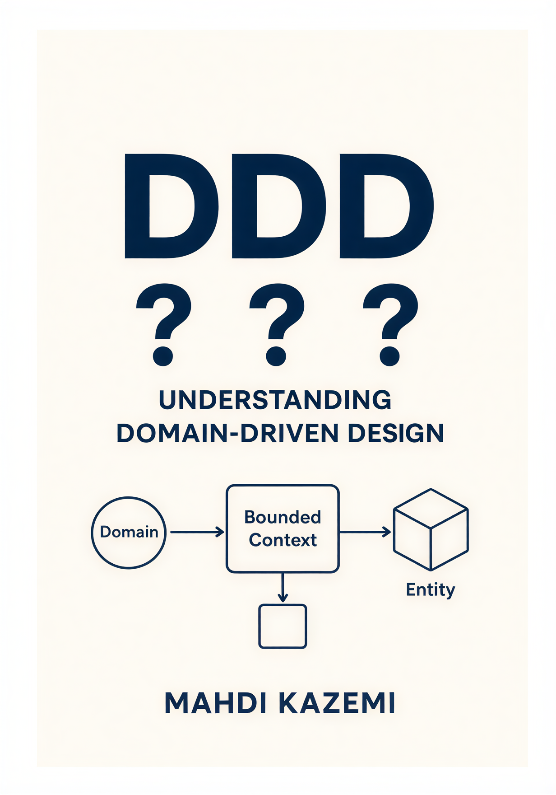

  

<h1 align="center">📘 درک عمیق Domain-Driven Design (DDD)</h1>

  <b>راهنمای جامع فارسی برای یادگیری مفاهیم طراحی دامنه-محور، طراحی استراتژیک و تاکتیکال</b>

  
  
  
  

<h1>

   <a href="https://hheydarian.github.io/Gitab/" target="_blank"><strong>  گیتاب — نسخه آنلاین کتاب </strong></a>

</h1>

---

## ✨ معرفی پروژه

این ریپازیتوری شامل نسخه آنلاین و ساختاریافته مقاله ارزشمند **«Understanding Domain-Driven Design»** نوشته‌ی **مهدی کاظمی** است.

این اثر تلاشی است برای ساده‌سازی و انتقال مفاهیم پیچیده **DDD** به جامعه نرم‌افزاری فارسی‌زبان. در این راهنما، شما با اصول طراحی استراتژیک (Strategic Design)، طراحی تاکتیکال (Tactical Design) و تکنیک‌های کشف دامنه (Domain Discovery) آشنا خواهید شد تا بتوانید نرم‌افزارهایی توسعه دهید که دقیقاً منطبق بر نیازهای پیچیده کسب‌و‌کار باشند.

هدف از ایجاد این ریپازیتوری، دسترسی راحت‌تر، خوانایی بهتر و امکان مشارکت جامعه برنامه‌نویسان در بهبود و تکمیل این منبع ارزشمند است. 🚀

👤 **درباره نویسنده مقاله:**
*   **مهدی کاظمی**
*   [LinkedIn](https://www.linkedin.com/in/mahdi-kazemi-career) | [GitHub](https://github.com/mahdikazemi96)

---

## ⚙️ پیش‌نیاز مطالعه

🔹 این راهنما برای معماران نرم‌افزار، توسعه‌دهندگان ارشد و تمام کسانی که می‌خواهند نرم‌افزارهای پیچیده تجاری (Enterprise) طراحی کنند، مناسب است.

🔹 برای تجربه خوانایی بهتر در مرورگر، توصیه می‌کنیم افزونه [فونت ایران](https://chromewebstore.google.com/detail/fontiran/edbchgkbejkdkdkpgenlaciegoidmjoh) را نصب کنید.

---

## 🙌 راه‌های مشارکت

ما به حضور شما در این پروژه افتخار می‌کنیم! هرچند متن اصلی متعلق به نویسنده است، اما مشارکت شما می‌تواند در جهت‌های زیر باشد:

- 🎨 **بهبود فرمت‌دهی و خوانایی متن (Markdown)**
- 💡 **افزودن مثال‌های کد جدید یا دیاگرام‌های شفاف‌تر**
- 📝 **اصلاح غلط‌های املایی یا نگارشی احتمالی**

---

## 🔗 فصل‌های کتاب (با لینک)

| شماره | نام فصل (انگلیسی) | نام فصل (فارسی) | وضعیت | لینک |
| :--- | :--- | :--- | :--- | :--- |
| 01 | DDD Fundamentals | مبانی و مفاهیم اولیه DDD | ✅ | [DDD Fundamentals](Book/01/DDD-Fundamentals/README.md) |
| 02 | Strategic Design: Subdomains | طراحی استراتژیک: شناخت دامین | ✅ | [Strategic Design: Subdomains](Book/02/Strategic-Design-Subdomains/README.md) |
| 03 | Bounded Contexts & Relationships | کانتکست‌های کران‌دار و روابط | ✅ | [Bounded Contexts & Relationships](Book/03/Bounded-Contexts-and-Relationships/README.md) |
| 04 | Domain Discovery & Distillation | کشف و تقطیر دامنه | ✅ | [Domain Discovery & Distillation](Book/04/Domain-Discovery-and-Distillation/README.md) |
| 05 | Tactical Design & Architecture | طراحی تاکتیکال و معماری فنی | ✅ | [Tactical Design & Architecture](Book/05/Tactical-Design-Architecture/README.md) |
| 06 | Conclusion & Roadmap | جمع‌بندی و مسیر آینده | ✅ | [Conclusion & Roadmap](Book/06/Conclusion-and-Roadmap/README.md) |

---

## 🧩 اصول ساختاری پروژه

- تمامی محتوا دقیقاً منطبق بر فایل PDF اصلی است و صرفاً به فرمت `.md` تبدیل شده است.
- کدها داخل بلوک‌های مناسب (`csharp`, `text`) قرار گرفته‌اند تا خوانایی بالاتری داشته باشند.
- ساختار پوشه‌بندی به گونه‌ای است که مطالعه فصل‌به‌فصل را آسان می‌کند.

---

## 🛡️ مجوز و حقوق نشر

<ul dir="rtl">
<li><b>حقوق معنوی محتوا:</b> تمام حقوق مادی و معنوی محتوای این اثر متعلق به نویسنده آن، <b>مهدی کاظمی</b> می‌باشد. این ریپازیتوری صرفاً جهت آرشیو و سهولت دسترسی ایجاد شده است.</li>
<li><b>انتشار:</b> استفاده از مطالب این مخزن با ذکر منبع و نام نویسنده بلامانع است.</li>
</ul>

---

## 🌟 قدردانی

از **مهدی کاظمی** بابت نگارش این مقاله ارزشمند و تمام کسانی که در مسیر یادگیری و اشتراک دانش مشارکت می‌کنند، سپاسگزاریم. 🌱

ساخته شده با ❤️ برای جامعه‌ی برنامه‌نویسان فارسی‌زبان

